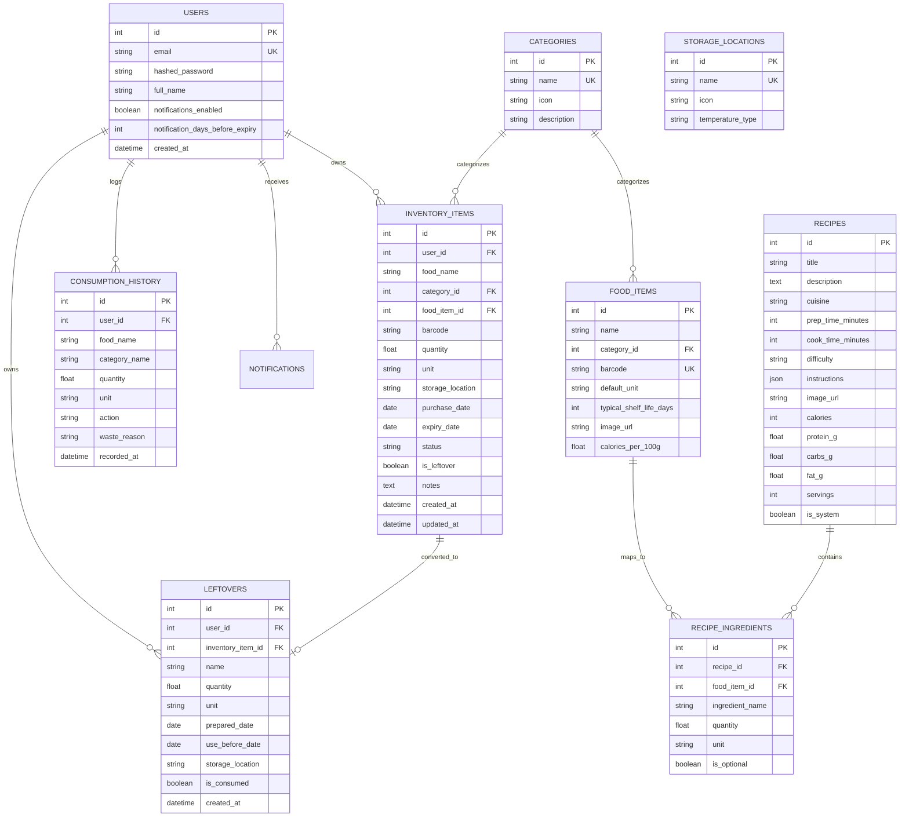

# Database Schema Documentation

## Relational Entity Relationship Diagram

```mermaid
erDiagram
    USERS ||--o{ INVENTORY_ITEMS : owns
    USERS ||--o{ LEFTOVERS : owns
    USERS ||--o{ CONSUMPTION_HISTORY : logs
    USERS ||--o{ NOTIFICATIONS : receives
    CATEGORIES ||--o{ FOOD_ITEMS : categorizes
    CATEGORIES ||--o{ INVENTORY_ITEMS : categorizes
    FOOD_ITEMS ||--o{ RECIPE_INGREDIENTS : maps_to
    RECIPES ||--o{ RECIPE_INGREDIENTS : contains
    INVENTORY_ITEMS ||--o| LEFTOVERS : converted_to

    USERS {
        int id PK
        string email UK
        string hashed_password
        string full_name
        boolean notifications_enabled
        int notification_days_before_expiry
        datetime created_at
    }

    CATEGORIES {
        int id PK
        string name UK
        string icon
        string description
    }

    STORAGE_LOCATIONS {
        int id PK
        string name UK
        string icon
        string temperature_type
    }

    FOOD_ITEMS {
        int id PK
        string name
        int category_id FK
        string barcode UK
        string default_unit
        int typical_shelf_life_days
        string image_url
        float calories_per_100g
    }

    INVENTORY_ITEMS {
        int id PK
        int user_id FK
        string food_name
        int category_id FK
        int food_item_id FK
        string barcode
        float quantity
        string unit
        string storage_location
        date purchase_date
        date expiry_date
        string status
        boolean is_leftover
        text notes
        datetime created_at
        datetime updated_at
    }

    LEFTOVERS {
        int id PK
        int user_id FK
        int inventory_item_id FK
        string name
        float quantity
        string unit
        date prepared_date
        date use_before_date
        string storage_location
        boolean is_consumed
        datetime created_at
    }

    RECIPES {
        int id PK
        string title
        text description
        string cuisine
        int prep_time_minutes
        int cook_time_minutes
        string difficulty
        json instructions
        string image_url
        int calories
        float protein_g
        float carbs_g
        float fat_g
        int servings
        boolean is_system
    }

    RECIPE_INGREDIENTS {
        int id PK
        int recipe_id FK
        int food_item_id FK
        string ingredient_name
        float quantity
        string unit
        boolean is_optional
    }

    CONSUMPTION_HISTORY {
        int id PK
        int user_id FK
        string food_name
        string category_name
        float quantity
        string unit
        string action
        string waste_reason
        datetime recorded_at
    }
```
